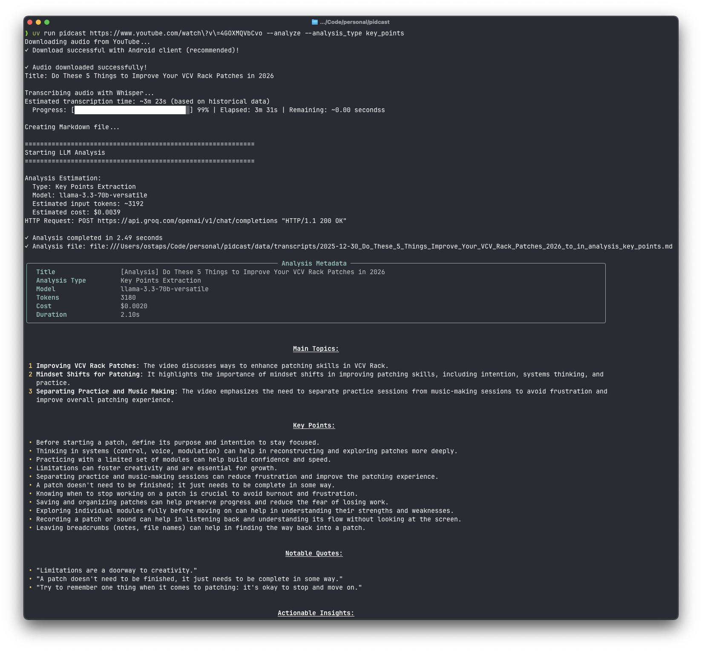

# Pidcast - YouTube Transcription Tool

YouTube transcription tool with local Whisper processing and LLM-powered analysis.

## Features

- 🎙️ **YouTube Audio Download** with fallback strategies and duplicate detection
- 📝 **Whisper Transcription** using whisper.cpp (local, fast)
- 🤖 **LLM Analysis** with Groq AI (enabled by default)
  - Automatic model fallback and retry logic
  - Smart chunking for long transcripts with semantic boundaries
  - JSON-validated structured output
- 📚 **Library Management** (NEW) - Manage podcast RSS feeds with persistent storage
  - Add/remove shows from your library
  - Preview episodes before adding
  - Fetch episode metadata from RSS feeds
- 📄 **Markdown Output** with YAML front matter and contextual tags
- 📊 **Smart Filenames** with date prefixes
- ⚡ **Fast Dependencies** managed with uv



## Quick Start

1. **Install uv**:
   ```bash
   curl -LsSf https://astral.sh/uv/install.sh | sh
   ```

2. **Clone and setup**:
   ```bash
   git clone <repo>
   cd pidcast
   uv sync
   ```

3. **Configure** (copy `.env.example` to `.env` and set):
   - `GROQ_API_KEY` - Get free key at https://console.groq.com/
   - `WHISPER_CPP_PATH` - Path to whisper.cpp main binary
   - `WHISPER_MODEL` - Path to Whisper model file
   - `OBSIDIAN_VAULT_PATH` - (Optional) For `--save_to_obsidian`

4. **Run**:
   ```bash
   # Transcribe with LLM analysis (default)
   uv run pidcast "https://youtube.com/watch?v=VIDEO_ID"

   # Transcription only (skip analysis)
   uv run pidcast "VIDEO_URL" --no-analyze

   # Save to Obsidian vault
   uv run pidcast "VIDEO_URL" --save_to_obsidian
   ```

## External Dependencies

The following tools must be installed separately:

- **yt-dlp** - YouTube audio download
- **ffmpeg** - Audio processing
- **whisper.cpp** - Transcription engine

### Installing whisper.cpp

1. Clone and build [whisper.cpp](https://github.com/ggerganov/whisper.cpp):
   ```bash
   git clone https://github.com/ggerganov/whisper.cpp.git
   cd whisper.cpp
   make
   ```

2. Download a Whisper model:
   ```bash
   bash ./models/download-ggml-model.sh base.en
   ```

3. Configure paths in `.env`:
   ```bash
   WHISPER_CPP_PATH=/path/to/whisper.cpp/main
   WHISPER_MODEL=/path/to/whisper.cpp/models/ggml-base.en.bin
   ```

## Usage Examples

### Single Episode Transcription

```bash
# Basic transcription with analysis (default)
uv run pidcast "https://www.youtube.com/watch?v=VIDEO_ID"

# Transcription only (skip analysis)
uv run pidcast "VIDEO_URL" --no-analyze

# Different analysis type
uv run pidcast "VIDEO_URL" --analysis_type key_points

# Analyze existing transcript without re-transcribing
uv run pidcast --analyze_existing transcript.md

# Transcribe local audio file
uv run pidcast "/path/to/audio/file.mp3"

# Force re-transcription (skip duplicate detection)
uv run pidcast "VIDEO_URL" --force

# Verbose output
uv run pidcast "VIDEO_URL" --verbose

# Use PO Token for restricted videos
uv run pidcast "VIDEO_URL" --po_token "client.type+TOKEN"
```

### Library Management (NEW)

Manage a persistent library of podcast shows for batch processing:

```bash
# Add a podcast to your library
uv run pidcast add "https://feeds.example.com/podcast.xml"

# Preview episodes before adding
uv run pidcast add "https://feeds.example.com/podcast.xml" --preview

# List all shows in library
uv run pidcast list

# Show details for a specific podcast (with recent episodes)
uv run pidcast show 1

# Show more episodes
uv run pidcast show 1 --episodes 10

# Remove a show from library
uv run pidcast remove 1
```

The library is stored at `~/.config/pidcast/library.yaml` (or `%APPDATA%\pidcast\library.yaml` on Windows) and is human-readable and editable.

## Analysis Prompts & Configuration

### Prompt Templates
Prompts are configured in `config/prompts.yaml`. Each prompt template defines:
- System and user prompts with variable substitution
- Max output tokens
- JSON response format for structured output with `analysis` and `contextual_tags`

Available analysis types:
- `executive_summary` (default) - Concise overview with key insights
- `key_points` - Bulleted highlights
- `action_items` - Actionable takeaways

### Model Configuration
Models and fallback chains are defined in `config/models.yaml`:
- Automatic fallback on rate limits or failures
- Token-based model selection for long transcripts
- Smart chunking for content exceeding context windows

### Chunking Strategy
Long transcripts are automatically chunked with:
- Semantic boundary detection (paragraph/sentence breaks)
- Overlap between chunks for context preservation
- Synthesis step to combine chunk analyses

## Development

### Code Quality

```bash
# Format code
uv run ruff format src/

# Lint code
uv run ruff check src/
uv run ruff check --fix src/  # Auto-fix issues
```

### Adding Dependencies

```bash
# Add runtime dependency
uv add package-name

# Add dev dependency
uv add --dev package-name

# Update all dependencies
uv sync --upgrade
```

## Documentation

See [CLAUDE.md](CLAUDE.md) for detailed documentation including:
- Architecture overview
- Download strategies
- LLM analysis configuration
- Custom prompt templates
- File organization
- Common patterns

## License

MIT
