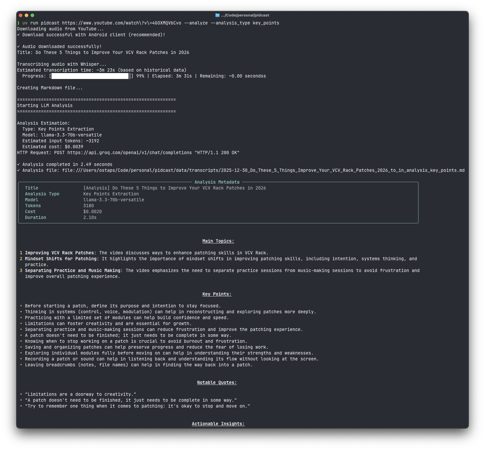

# Pidcast

> [!TIP]
> ✨ ***Podcasts and YouTube, transcribed and summarized on your terms.***

Single-shot CLI: pass a YouTube URL, an Apple Podcasts URL, or a local audio file — get back a Markdown note with transcript, optional speaker labels, and an LLM-written analysis. Output is Obsidian-ready.

> [!NOTE]
> [🎬 Demo](#demo) · [⚡ Usage](#usage) · [🔧 Setup](#setup) · [🎙️ Providers](#providers) · [👥 Diarization](#diarization) · [🧠 Analysis](#analysis) · [📦 Presets](#presets) · [🗂️ Output](#output) · [🛠️ Development](#development)

## 📦 Installation <a name="installation"></a>

**Requirements:** Python 3.10+, [uv](https://docs.astral.sh/uv/), ffmpeg. Optional: whisper.cpp (for local transcription).

```bash
git clone https://github.com/kintecus/pidcast && cd pidcast && uv sync
uv run pidcast setup
uv run pidcast "https://youtube.com/watch?v=VIDEO_ID"
```

`pidcast setup` walks through picking a transcription backend (whisper.cpp local, or ElevenLabs cloud) and collecting API keys. Run `pidcast doctor` any time to check configuration.

## 🎬 Demo <a name="demo"></a>



## ⚡ Usage <a name="usage"></a>

```bash
# YouTube
uv run pidcast "https://www.youtube.com/watch?v=VIDEO_ID"

# Apple Podcasts episode URL
uv run pidcast "https://podcasts.apple.com/us/podcast/.../id123?i=456"

# Local audio
uv run pidcast "/path/to/audio.mp3"
```

Common flags:

```bash
uv run pidcast "URL" --no-analyze            # transcribe only
uv run pidcast "URL" -a key_points           # different analysis template
uv run pidcast "URL" --diarize               # speaker labels
uv run pidcast "URL" -l uk                   # language hint
uv run pidcast "URL" -o                      # save analysis to Obsidian vault
uv run pidcast "URL" -f                      # force, skip duplicate detection
uv run pidcast "URL" --tags meeting,standup  # override auto tags

uv run pidcast --analyze-existing transcript.md   # reanalyze without re-transcribing
uv run pidcast --diarize-existing transcript.md   # add speaker labels to a prior run
```

Try settings on a slice first:

```bash
uv run pidcast "URL" --test-segment            # first 2 min
uv run pidcast "URL" --test-segment 3 --start-at 10   # 3 min from 10:00
```

Restricted YouTube videos:

```bash
uv run pidcast "URL" --po-token "client.type+TOKEN"
uv run pidcast "URL" --cookies-from-browser chrome --chrome-profile "Default"
```

## 🔧 Setup <a name="setup"></a>

```bash
uv run pidcast setup
```

The wizard configures:

- **Transcription backend** — whisper.cpp (local, private) or ElevenLabs (cloud, faster)
- **API keys** — `GROQ_API_KEY`, `ELEVENLABS_API_KEY`, `HUGGINGFACE_TOKEN` as needed
- **`.env` file** — created on first run

Optional env vars:

- `GROQ_API_KEY` — LLM analysis (free at <https://console.groq.com/>)
- `OBSIDIAN_VAULT_PATH` — `-o` writes analysis into this vault
- `HUGGINGFACE_TOKEN` — required for whisper-based diarization
- `ELEVENLABS_API_KEY` — required for cloud transcription

User config (presets, chrome profile): `~/.config/pidcast/config.yaml`.

## 🎙️ Providers <a name="providers"></a>

**Transcription** — default is local whisper.cpp:

```bash
uv run pidcast "URL" --transcription-provider whisper     # default
uv run pidcast "URL" --transcription-provider elevenlabs  # cloud Scribe v2
```

ElevenLabs includes built-in diarization (no HuggingFace token needed). Time estimates adapt per-provider based on history in `data/transcripts/transcription_stats.json`.

**LLM analysis** — default is Groq:

```bash
uv run pidcast "URL" --provider groq                    # default
uv run pidcast "URL" --provider claude                  # local Claude CLI
uv run pidcast "URL" --provider claude --claude-model opus
```

Claude model aliases: `sonnet` (default), `opus`, `haiku`. Model fallback on rate limits is automatic; long transcripts are chunked with a synthesis pass.

## 👥 Diarization <a name="diarization"></a>

Speaker identification via [pyannote.audio](https://github.com/pyannote/pyannote-audio), runs locally.

```bash
uv pip install 'pidcast[diarize]'
```

Then add `HUGGINGFACE_TOKEN=hf_...` to `.env` and accept both model licenses ([pyannote/speaker-diarization-3.1](https://huggingface.co/pyannote/speaker-diarization-3.1), [pyannote/segmentation-3.0](https://huggingface.co/pyannote/segmentation-3.0)).

```bash
uv run pidcast "URL" --diarize
```

First run downloads ~1 GB. Output uses `**Speaker 1**` / `**Speaker 2**` labels and adds `speaker_count` / `diarized: true` to the front matter.

## 🧠 Analysis <a name="analysis"></a>

Prompts live in `config/prompts.yaml`. Each defines system/user prompts, max output tokens, and a JSON response schema (`analysis` + `contextual_tags`).

Available types:

- `executive_summary` (default) — concise overview with key insights
- `summary` — comprehensive summary
- `key_points` — bulleted highlights
- `action_items` — actionable takeaways
- `comprehensive` — archival-quality detailed guide

Every analysis ends with a **Shareable Brief**: a ≤15-word headline plus a 3-5 sentence casual take.

Models and fallback chain live in `config/models.yaml`. Token-aware selection picks a model that fits; anything past the context window goes through semantic chunking with synthesis.

## 📦 Presets <a name="presets"></a>

Named flag bundles in `~/.config/pidcast/config.yaml`:

```yaml
presets:
  daily:
    whisper_model: large-v3
    language: uk
    diarize: true
    no_analyze: true
```

```bash
uv run pidcast "URL" -p daily
uv run pidcast -P            # list available presets
```

Explicit flags override preset values.

## 🗂️ Output <a name="output"></a>

Each run writes a Markdown file with:

- YAML front matter (title, source URL, date, duration, tags, speaker count when diarized)
- Auto-inferred source tags (`youtube`, `apple-podcasts`, `local`) unless `--tags` overrides
- Date-prefixed filename: `2026-04-18_Episode-Title.md`
- Full transcript (optionally with speaker labels)
- LLM analysis section (unless `--no-analyze`)

Defaults to the current directory. `--output-dir` changes it; `-o` sends analysis to `OBSIDIAN_VAULT_PATH`.

## 🛠️ Development <a name="development"></a>

```bash
pre-commit install
uv run ruff format src/ && uv run ruff check src/
uv run pytest
```

Architecture and state audit: [`docs/state-audit.md`](docs/state-audit.md). Project-specific agent instructions: [`CLAUDE.md`](CLAUDE.md).
