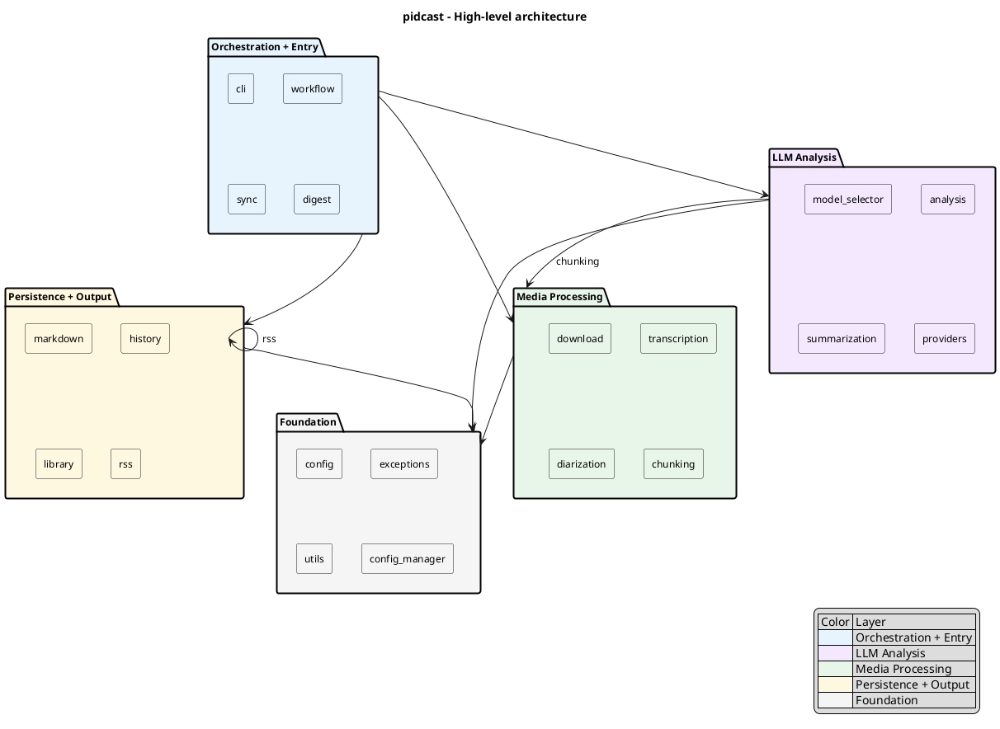
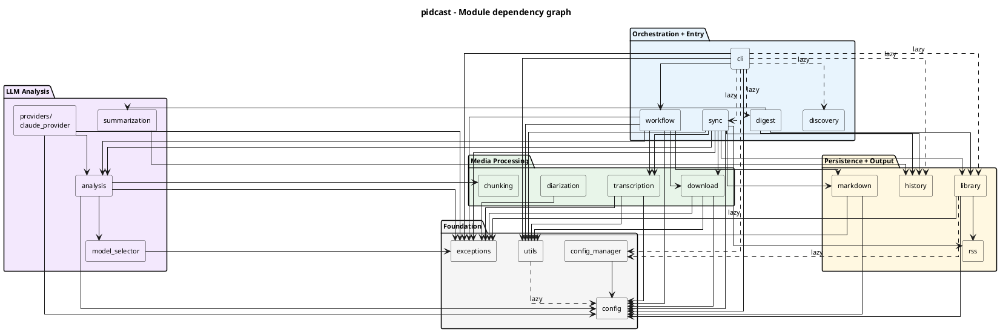
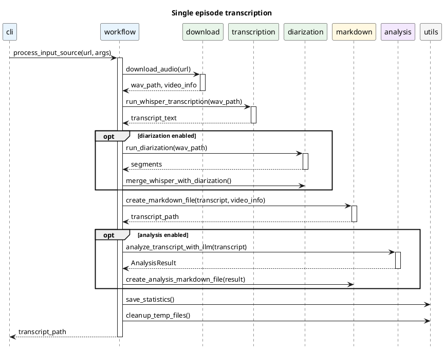
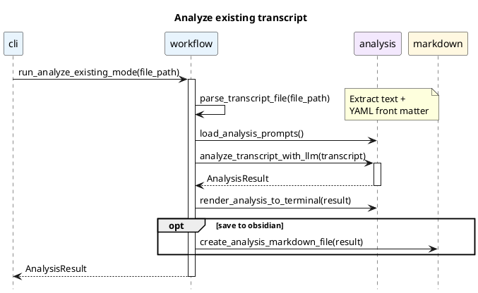
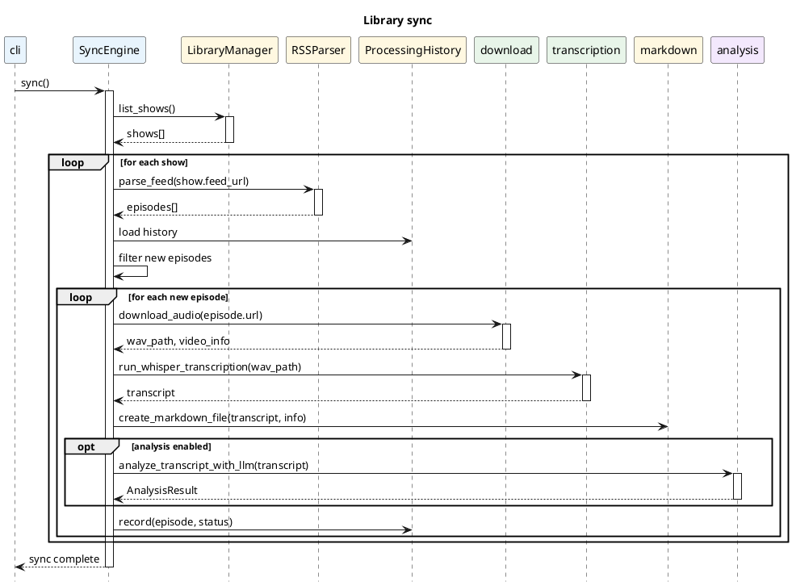
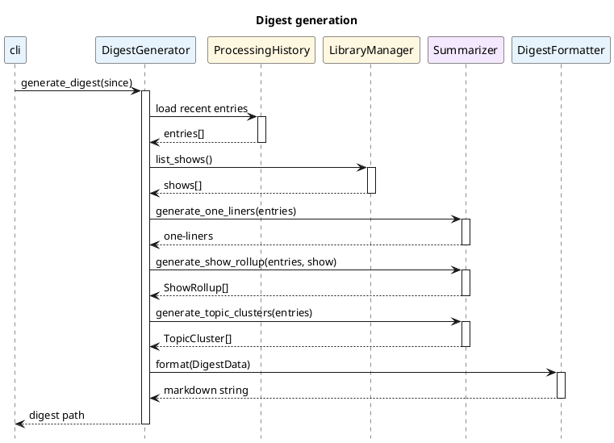

# pidcast architecture

Central reference for how pidcast modules are organized, how they depend on each other, and how the core workflows flow through the codebase.

## High-level component diagram

Five layer groups with inter-group dependency arrows.

## Module dependency graph

Every module and its internal imports. Solid arrows = top-level imports, dashed arrows = lazy/runtime imports.

![PlantUML Diagram](https://www.plantuml.com/plantuml/svg/RLR1JXin4BtxAomuj1KA2BL8j8UAIYGd44ZqrbR8NJkxLhpsolOIbgh_tXdROtP3bKEUvysCP-mtJgv253wElM5HHwFue6KZGkGhVkla20Qf1cMbiit4Mo-6Zh6mqtOGNlIySVtWhBBn8KxWwbKJXMsDchb8jHMZYHi7Jlf5yVFp6IcyT_lldMvsLeN0vvJHLiLfKDpvs3d6tl7LQiKtRhHIHEqiBjaWcfre5JzwjHzn4VWMb_nuSu4V_eTn_gDnTglRNyWssvOuPDHpemOC3Oc5vPmTepQP6AEP4pdXOoyiLE1puhxrrUKlrNohf1Rythi6UjIsNLP-oARw-sGyNbzkBjQVS_tIxQrnGgQDf24IgUY53OtNgOd4n-Sv3xcyVX6LdULEZNIZXMClPzFjAbSxkBcvvT-iC5FGOLdzd4cL6zF32No43DUvRb7Ob1qMn2BNEwdCOr06TEFo4VPXxX36lb_MZfQvn-3TavRAXxEVjZ5YbEgHJBcVeNhNTkx1NOS8abRyXD-DSHZZigt_UQJsXan0pitcSdsUMuGITtWzkG59958TE3i_9QQR1I9dz6yl2WTuJlcGpmk-gxcMV-URJWMuzBTZiAHE-Df6FwN27J3fOZ_HnJH6vnCocWWqxvtVROtR9sw_dLDXias-XCdExLAti6cHLhjaGkEUL6aILvMjxJmuesL-2S8N7jsmCkf96QxXQV4nwmrSIVyCjBzQVSKX9WWJIn1c59qN4y5W6YYYG8mei4JCPeJXV90NKAHWXkfDYRhTAuQaXD6VS1ymT2bmreTvteMuMH8siYWJf0_Kp439ICC6177l0ajAKY835P97WQNF8Zg6WYCFmfY4C2Wl5R5uv5Xwu2WCQ18B0w5GSGMYHu7I4C8T2kmbeVXCgDI8EcEeCKf967CIXgG4CIlXT7gqW6OgXlq8Oc-4ONE2LGcePePAhWbfWGa9uuNbUzByVPNj1uRhUZi5OuM4SHl2-orDmRK8dNeT0oDUfZC_sgXxjPW4Z3mzJPNmx5PDwNqvi65l1wOqXMzixQ4fNNMnuMQ7DlmrJBPj3MLNy4S1_ady0m00)

## Module reference table

| Module | Layer | Key exports | Description |
|--------|-------|-------------|-------------|
| `config` | Foundation | `VideoInfo`, `TranscriptionStats`, `AnalysisResult`, `PromptTemplate`, `PromptsConfig`, `get_project_root()`, `get_config_dir()` | Configuration constants, dataclasses, path resolution, env loading |
| `exceptions` | Foundation | `PidcastError`, `DownloadError`, `TranscriptionError`, `AnalysisError`, `ConfigurationError`, `LibraryError`, `DiarizationError` | Custom exception hierarchy |
| `utils` | Foundation | `setup_logging()`, `sanitize_filename()`, `create_smart_filename()`, `find_existing_transcription()`, `save_statistics()`, `cleanup_temp_files()` | Logging, filename handling, JSON I/O, duplicate detection |
| `config_manager` | Foundation | `ConfigManager` | File-based config management for library settings |
| `download` | Media Processing | `download_audio()`, `build_download_strategies()`, `VideoDownloadInfo` | YouTube audio download via yt-dlp with fallback strategies |
| `transcription` | Media Processing | `run_whisper_transcription()`, `process_local_file()`, `resolve_whisper_model()` | Whisper.cpp integration for audio-to-text |
| `diarization` | Media Processing | `DiarizationSegment`, `run_diarization()`, `merge_whisper_with_diarization()` | Speaker diarization using pyannote.audio |
| `chunking` | Media Processing | `chunk_transcript()`, `needs_chunking()`, `estimate_tokens()`, `format_chunk_for_analysis()` | Semantic transcript chunking for long content |
| `model_selector` | LLM Analysis | `ModelSelector`, `ModelConfig`, `load_models_config()`, `with_retry()` | Model selection, rate limit handling, retry with backoff |
| `analysis` | LLM Analysis | `analyze_transcript_with_llm()`, `load_analysis_prompts()`, `parse_llm_json_response()`, `render_analysis_to_terminal()` | Core LLM analysis pipeline via Groq API with chunking |
| `summarization` | LLM Analysis | `Summarizer` | Episode and digest summarization via Groq |
| `providers/claude_provider` | LLM Analysis | `analyze_with_claude_cli()`, `CLAUDE_MODELS` | Claude CLI provider (alternative to Groq) |
| `markdown` | Persistence + Output | `create_markdown_file()`, `create_analysis_markdown_file()`, `format_yaml_front_matter()` | Markdown output with YAML front matter for Obsidian |
| `history` | Persistence + Output | `ProcessingHistory`, `HistoryEntry`, `ProcessingStatus` | Processing history tracking with JSON persistence |
| `library` | Persistence + Output | `LibraryManager`, `Show` | Podcast library management with YAML persistence |
| `rss` | Persistence + Output | `RSSParser`, `Episode` | RSS feed parsing with retry logic |
| `cli` | Orchestration + Entry | `main()`, `DuplicateAction` | CLI with argparse, duplicate detection, library commands |
| `workflow` | Orchestration + Entry | `process_input_source()`, `run_analyze_existing_mode()`, `parse_transcript_file()` | Core workflow orchestration |
| `sync` | Orchestration + Entry | `SyncEngine` | Automated podcast sync (download + transcribe + analyze) |
| `digest` | Orchestration + Entry | `DigestGenerator`, `DigestFormatter`, `DigestData` | Multi-tier digest generation with topic clustering |
| `discovery` | Orchestration + Entry | `discover_podcast()`, `search_itunes_api()`, `prompt_user_selection()` | Podcast discovery via Apple Podcasts and iTunes API |
| `__init__` | Entry | `__version__` | Package init with version |
| `__main__` | Entry | - | `python -m pidcast` entry point |

## Core workflow sequence diagrams

### Single episode transcription

`process_input_source()` - the primary flow for transcribing a URL or local file.

### Analyze existing transcript

`run_analyze_existing_mode()` - re-analyze an already-transcribed file.

### Library sync

`SyncEngine.sync()` - automated sync of subscribed podcast feeds.

### Digest generation

`DigestGenerator.generate_digest()` - create a multi-tier digest from processing history.

## Configuration and data files

| File | Purpose |
|------|---------|
| `.env` / `.env.example` | API keys (GROQ_API_KEY), Obsidian path, whisper model path |
| `config/prompts.yaml` | LLM analysis prompt templates with JSON response format |
| `config/models.yaml` | LLM model definitions, rate limits, fallback chains |
| `data/transcripts/` | Generated transcript and analysis markdown files |
| `data/transcripts/transcription_stats.json` | Historical run statistics (duration, model, token counts) |
| `~/.config/pidcast/config.yaml` | Library settings (backfill limit, output dirs, cache hours) |
| `~/.config/pidcast/library.yaml` | Subscribed podcast shows |
| `~/.config/pidcast/history.json` | Processing history for sync engine |
