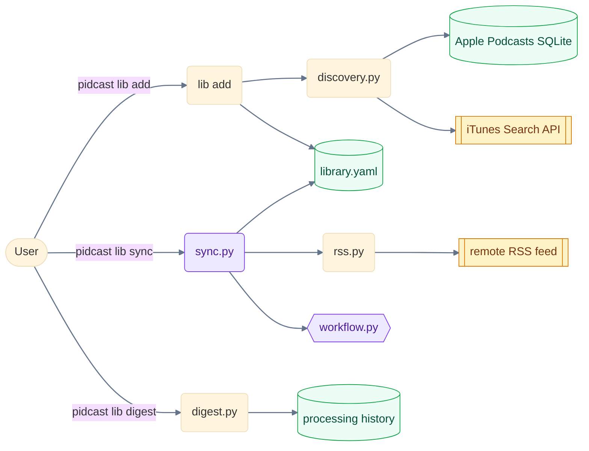

# Architecture

pidcast is a single-shot CLI: given an input source, it produces a Markdown transcript with optional LLM analysis and writes it to disk (or an Obsidian vault). The same binary also manages a podcast library and runs batch syncs across subscribed feeds.

This document maps the runtime data flow and the module boundaries. Start here when adding a feature that crosses module lines.

## Data flow (single-shot path)

```mermaid
%%{init: {'theme':'base','flowchart':{'curve':'basis','nodeSpacing':60,'rankSpacing':80}}}%%
flowchart TD
    accTitle: pidcast single-shot transcription and analysis pipeline
    accDescr: A URL or file is resolved to audio, normalized to WAV, transcribed by the chosen provider, optionally diarized, optionally analyzed by a Groq or Claude model, then written as Markdown to disk or an Obsidian vault. Run history and stats are persisted.

    User([User]) -->|pidcast URL_OR_PATH| CLI{{cli.py}}
    CLI --> Workflow{{workflow.py}}

    Workflow --> Resolve{Input type?}
    Resolve -->|YouTube / Apple Podcasts / RSS| Download(download.py)
    Resolve -->|Local file| LocalAudio[/audio file/]
    Resolve -->|Apple Podcasts URL| AP(apple_podcasts.py)
    Resolve -->|RSS feed| RSS(rss.py)

    Download --> Audio[/raw audio/]
    AP --> Audio
    RSS --> Audio
    LocalAudio --> Audio

    Audio --> Normalize(ffmpeg<br/>16kHz mono WAV)

    Normalize --> ProviderPick{Transcription<br/>provider?}
    ProviderPick -->|whisper| Whisper[[whisper.cpp]]
    ProviderPick -->|elevenlabs| EL[[ElevenLabs Scribe v2]]

    Whisper --> WhisperJSON[/whisper.json/]
    EL --> ELOut[/segments + speakers/]

    WhisperJSON --> DiarizeQ{--diarize?}
    ELOut --> DiarizeQ
    DiarizeQ -->|whisper + yes| Pyannote[[pyannote.audio]]
    DiarizeQ -->|elevenlabs + yes| BuiltinSpk[built-in speakers]
    DiarizeQ -->|no| Plain[plain segments]
    Pyannote --> Merge(diarization.py)
    BuiltinSpk --> Merge
    Plain --> Merge

    Merge --> AnalyzeQ{--no-analyze?}
    AnalyzeQ -->|analyze| ChunkCheck{> 120k chars?}
    AnalyzeQ -->|skip| Markdown(markdown.py)
    ChunkCheck -->|yes| Chunking(chunking.py)
    ChunkCheck -->|no| Analyze(analysis.py + summarization.py)
    Chunking --> Analyze

    Analyze --> LLM{LLM provider?}
    LLM -->|groq| Groq[[Groq API]]
    LLM -->|claude| Claude[[Claude Code CLI]]
    Groq --> JSON[/analysis JSON/]
    Claude --> JSON
    JSON --> Markdown

    Markdown --> Out{--save-to-obsidian?}
    Out -->|yes| Vault[(Obsidian vault)]
    Out -->|no| Disk[(data/transcripts/)]

    Markdown --> Stats[(transcription_stats.json)]
    Markdown --> History[(history.py)]

    classDef storage fill:#ecfdf5,stroke:#16a34a,color:#064e3b;
    classDef external fill:#fef3c7,stroke:#d97706,color:#78350f;
    classDef orchestrator fill:#ede9fe,stroke:#7c3aed,color:#4c1d95;
    class Vault,Disk,Stats,History storage;
    class Whisper,EL,Pyannote,Groq,Claude external;
    class CLI,Workflow orchestrator;

    linkStyle default stroke:#64748b,stroke-width:1.5px
```

## Library subsystem

Subscriptions to RSS feeds and Apple Podcasts shows live in a separate, persistent layer that drives batch processing.

The library file lives at `~/.config/pidcast/library.yaml` (macOS/Linux) or `%APPDATA%\pidcast\library.yaml` (Windows) and is human-readable.

## Component boundaries

| Layer | Modules | Responsibility |
|-------|---------|----------------|
| **Entry** | `cli.py` | argparse surface, dispatch to workflow or `lib` subtree |
| **Orchestration** | `workflow.py`, `sync.py` | sequence the pipeline steps for one input or for a batch |
| **Input resolution** | `download.py`, `apple_podcasts.py`, `rss.py`, `discovery.py`, `cookies.py` | turn a URL or feed entry into a local audio file |
| **Transcription** | `transcription.py`, `providers/` | provider-agnostic API over whisper.cpp and ElevenLabs |
| **Speaker labeling** | `diarization.py` | merge pyannote or ElevenLabs speaker turns into the transcript |
| **Analysis** | `analysis.py`, `summarization.py`, `chunking.py`, `model_selector.py` | prompt execution, JSON validation, semantic chunking, model fallback |
| **Persistence** | `markdown.py`, `history.py`, `digest.py` | front matter, filenames, run stats, digest assembly |
| **Library** | `library.py`, `sync.py` | YAML-backed podcast subscription store |
| **Config/setup** | `config.py`, `config_manager.py`, `setup.py` | env loading, wizard, doctor checks |
| **Cross-cutting** | `utils.py`, `exceptions.py` | filename smart-prefixes, duplicate detection, error types |

## Provider abstractions

Two pluggable axes:

| Axis | Choices | Selector |
|------|---------|----------|
| Transcription | `whisper` (local, default), `elevenlabs` (cloud) | `--transcription-provider` |
| LLM analysis | `groq` (default), `claude` (local Claude Code CLI) | `--provider` |

Decisions behind these abstractions are recorded in [ADRs](adr/).

## Audio pipeline invariant

Every audio input is normalized to **16 kHz mono WAV** before transcription, regardless of source format (mp3, m4a, opus, wav, etc.). This is centralized in the ffmpeg helper invoked by `workflow.py` and by `scripts/diarize-existing.sh`. Modules downstream of normalization MUST assume this invariant — never re-derive sample rate or channel count from upstream metadata.

## Chunking threshold

Transcripts whose text length exceeds **120 000 characters** are routed through `chunking.py`, which splits on semantic boundaries (paragraphs > sentences), runs analysis per chunk, and synthesizes a final result. This threshold is empirical and lives in `config.py`; raise it cautiously because most Groq models have shorter usable contexts than the nominal token limit suggests.

## Failure modes

| Stage | Most common failure | Where it surfaces |
|-------|--------------------|--------------------|
| Download | YouTube `Sign in to confirm you're not a bot` | `download.py` — pass `--cookies-from-browser` or `--po-token` |
| Audio normalize | `ffmpeg: command not found` | `pidcast doctor` flags it |
| Transcription (whisper) | Missing model file | `pidcast doctor` flags it; `setup.py` can download |
| Transcription (elevenlabs) | 401, 413 (payload too large) | `transcription.py` retries with smaller chunks for 413 |
| Diarization | HUGGINGFACE_TOKEN missing or model license not accepted | Raises `DiarizationError`; see `--diarize-existing` to retry separately |
| Analysis | Rate limit, JSON parse failure | `model_selector.py` falls back through `config/models.yaml` chain |

## Related docs

- [README.md](../README.md) — user-facing overview
- [CLAUDE.md](../CLAUDE.md) — agent instructions, module map
- [docs/development-guide.md](development-guide.md) — dev environment, testing, CI
- [docs/adr/](adr/) — decision records
