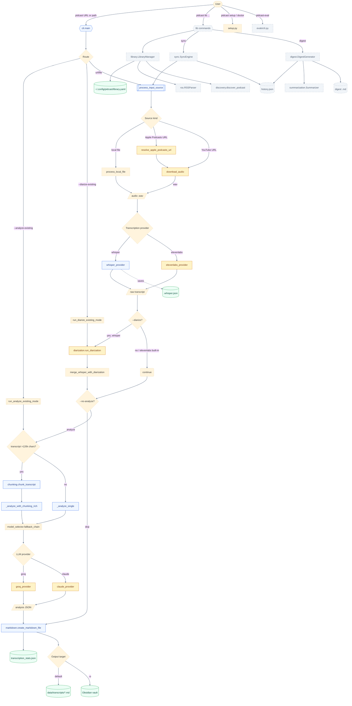

# Pidcast state audit

## Context

Pidcast is ~10.4k lines across 25 modules in `src/pidcast/` plus a 12-module `evals/` subpackage. The surface has drifted from the original "URL-in, markdown-out" intent and now bundles a podcast library manager (add/list/sync/digest), a discovery search, an RSS parser, and an evaluation framework.

**Target identity:** single-shot transcriber. Inputs are YouTube URLs, Apple Podcasts URLs, and local audio files. Output is a markdown note with optional LLM analysis. Diarization stays because it's actively used. Library management, sync, digest, and evals are out of scope going forward.

This document maps the current state so pruning decisions can be made against a concrete baseline.

## Module inventory

| Module | LoC | Role | Keep for single-shot? |
|---|---:|---|---|
| `cli.py` | 1760 | Arg parsing, command routing, entry point | Keep (shrink) |
| `workflow.py` | 1087 | `process_input_source`, analyze-existing, diarize-existing | Keep (trim) |
| `analysis.py` | 1214 | Groq LLM calls, JSON parsing, chunked synthesis, Rich progress | Keep (split) |
| `transcription.py` | 538 | whisper.cpp invocation, audio standardization, time estimates | Keep |
| `download.py` | 461 | yt-dlp strategies, browser cookies, PO token retry | Keep |
| `utils.py` | 858 | Filenames, logging, duplicate detection, fuzzy resolvers | Keep (split) |
| `config.py` | 484 | Env vars, dataclasses | Keep |
| `model_selector.py` | 430 | Model fallback chain, TPM-aware selection | Keep |
| `markdown.py` | 228 | YAML front matter, source-tag inference, file writing | Keep |
| `chunking.py` | 274 | Semantic boundary chunking with overlap | Keep |
| `diarization.py` | 172 | pyannote.audio pipeline + whisper segment merge | **Keep** |
| `apple_podcasts.py` | 253 | Apple URL → RSS resolution via iTunes API | Keep |
| `cookies.py` | 179 | Browser cookie extraction cache | Keep |
| `setup.py` | 221 | `doctor` + `setup` checks | Keep |
| `config_manager.py` | 166 | User config + presets loader | Keep |
| `exceptions.py` | 79 | Custom exception classes | Keep |
| `providers/whisper_provider.py` | — | Whisper provider | Keep |
| `providers/elevenlabs_provider.py` | — | ElevenLabs Scribe v2 provider | Keep |
| `providers/groq_provider.py` | — | Groq provider wrapper | Keep |
| `providers/claude_provider.py` | — | Claude CLI analysis provider | Keep |
| `library.py` | 331 | `LibraryManager`, `Show` dataclass, YAML persistence | **Remove** |
| `sync.py` | 367 | `SyncEngine` — batch episode processing | **Remove** |
| `digest.py` | 373 | `DigestGenerator` — cross-show rollups | **Remove** |
| `rss.py` | 349 | `Episode` dataclass + `RSSParser` | **Reduce** |
| `discovery.py` | 159 | Apple Podcasts local DB + iTunes search | **Remove** |
| `history.py` | 181 | Processing history (sync/digest) | **Remove** |
| `summarization.py` | 240 | `Summarizer` — used only by digest | **Remove** |
| `evals/` (12 files) | ~5000 | Provider comparisons, batch eval, cost tracking | **Remove** (experimental) |

## Flow inventory

All user-facing paths through the CLI, ordered by frequency of expected use.

| # | Flow | Trigger | Entry chain | Output | Fit |
|---:|---|---|---|---|---|
| 1 | YouTube transcribe + analyze | `pidcast <yt-url>` | `cli.main` → `process_input_source` → `download_audio` → whisper/elevenlabs → `analyze_transcript_with_llm` → `create_markdown_file` | `<date>_<title>.md` | Core |
| 2 | Apple Podcasts URL | `pidcast <apple-url>` | `cli.main` → `resolve_apple_podcasts_url` → `download_audio` → … | Same as 1 | Core |
| 3 | Local audio file | `pidcast /path/to.mp3` | `cli.main` → `process_local_file` → whisper/elevenlabs → … | Same as 1 | Core |
| 4 | Transcribe only | `--no-analyze` | As 1/2/3 without analysis | Transcript `.md` only | Core |
| 5 | Analyze existing transcript | `--analyze-existing <path>` | `run_analyze_existing_mode` → `analyze_transcript_with_llm` | Analysis `.md` | Core |
| 6 | Re-diarize existing | `--diarize-existing <path>` | `run_diarize_existing_mode` → `.whisper.json` → `run_diarization` → rewrite md | Updated md with speaker labels | Core |
| 7 | Test segment | `--test-segment [N] --start-at M` | As 1/2/3 + `extract_audio_segment` | Raw transcript only | Core (dev UX) |
| 8 | Force re-transcribe | `-f` / `--force` | Skips duplicate detection | Same as 1 | Core |
| 9 | Obsidian save | `-o` / `--save-to-obsidian` | Analysis → `OBSIDIAN_PATH` | Analysis in vault | Core |
| 10 | Save analysis file | `--save` | Writes analysis md | Analysis md | Core |
| 11 | Custom tags / front matter | `--tags`, `--front-matter` | Overrides auto-inferred tags | Front matter tweaks | Core |
| 12 | Transcription provider swap | `--transcription-provider {whisper,elevenlabs}` | Provider factory | — | Core |
| 13 | LLM provider swap | `--provider {groq,claude}` `--claude-model` | `analyze_transcript_with_llm` branches | — | Core |
| 14 | Language override | `-l <code>` | Passed to provider | — | Core |
| 15 | Whisper model choose | `--whisper-model` | `resolve_whisper_model` fuzzy match | — | Core |
| 16 | Groq model choose | `-m` / `--groq-model` | `resolve_model_name` fuzzy match | — | Core |
| 17 | YouTube cookies | `--po-token`, `--cookies-from-browser`, `--cookies`, `--chrome-profile` | `cookies.py` cache + yt-dlp retry | — | Core |
| 18 | Diagnostics | `pidcast doctor` | `setup.run_all_checks` | Status table | Core |
| 19 | Setup wizard | `pidcast setup` | Interactive prompts for ffmpeg/whisper/keys | Writes `.env` | Core |
| 20 | Discovery lists | `-L`, `-M`, `-W`, `--list-chrome-profiles` | One-off listings | stdout | Core |
| 21 | Presets | `-p <name>`, `-P`, `--list-presets` | `apply_preset` overrides args | — | Core |
| 22 | `lib add` (name or RSS) | `pidcast lib add <q>` | `discovery.discover_podcast` → `RSSParser` → YAML write | library.yaml entry | **Remove** |
| 23 | `lib list` / `show` / `remove` | `pidcast lib …` | `LibraryManager` CRUD | — | **Remove** |
| 24 | `lib sync` | `pidcast lib sync` | `SyncEngine` iterates shows | Batch mds + history | **Remove** |
| 25 | `lib process <show>` | `pidcast lib process` | Picks episode → `process_input_source` | Single md | **Remove** (redundant with flow 2) |
| 26 | `lib digest` | `pidcast lib digest` | `DigestGenerator` rolls up history | Digest file | **Remove** |
| 27 | `pidcast-eval` | Separate console script | `evals.cli.eval_main` — batch, matrix, single, compare | Eval reports | **Remove** (experimental) |

## Data-flow diagram

Current graph with nodes colored by role. Dashed gray nodes are flagged for removal. Core single-shot path is blue.

## Pruning recommendations

### Remove outright (high confidence)

| Target | Files | Rationale | LoC saved |
|---|---|---|---:|
| Library CRUD | `library.py`, `cli.py` `cmd_add/list/show/remove` | Not in single-shot identity. Library YAML has no dependents outside sync/digest. | ~600 |
| Sync engine | `sync.py`, `cli.py` `cmd_sync/cmd_process` | Batch processing is a separate product. | ~500 |
| Digest generator | `digest.py`, `summarization.py`, `cli.py` `cmd_digest` | Depends on sync history; goes with the library. | ~615 |
| Processing history | `history.py` | Only used by sync/digest. `transcription_stats.json` already covers duplicate detection. | ~180 |
| Podcast discovery | `discovery.py` | Used only by `lib add`. Apple Podcasts URL resolution doesn't need search. | ~160 |
| RSS parser (most of it) | `rss.py` | Apple resolver only needs a ~50 LoC helper; fold it into `apple_podcasts.py`. | ~300 net |
| Evals framework | `src/pidcast/evals/` (12 files), `pidcast-eval` script, `config/eval_prompts.json`, `config/reference_transcripts.json`, `data/evals/` | Experimental, off the single-shot path. | ~5000 |

**Total: ~7.4k LoC, roughly 70% of current source.**

### Reduce (medium confidence)

- **`cli.py` 1760 → ~600.** Remove the `lib` subparser and all `cmd_*` handlers. What remains is a flat transcription parser plus `doctor`/`setup` dispatch.
- **`analysis.py` 1214 → split.** Three concerns live in one file:
  - `llm_client.py` — Groq/Claude call + fallback + retry
  - `chunked_analysis.py` — chunking orchestration + synthesis
  - `json_parsing.py` — JSON validation, truncation, prompt substitution
- **`utils.py` 858 → split.** Move `resolve_analysis_type`, `resolve_model_name`, `list_available_*` into a new `resolvers.py`. Keep filenames/logging/duplicate detection in `utils.py`.
- **`workflow.py` 1087 → trim.** Keep the three top-level orchestrators (`process_input_source`, `run_analyze_existing_mode`, `run_diarize_existing_mode`). Move private helpers (`parse_transcript_file`, `render_analysis_to_terminal_direct`, `_extract_whisper_model_name`, `run_analysis`) to their owning modules.

### Keep (high confidence core)

- **Diarization** (`diarization.py`, `--diarize`, `--diarize-existing`). Actively used. Pyannote stays as an optional extra.
- **Apple Podcasts URL resolution** (`apple_podcasts.py`). First-class input source.
- **Provider splits.** `whisper`/`elevenlabs` for transcription, `groq`/`claude` for analysis — each provider file is small and genuinely useful.
- **Presets**, **`doctor`**, **`setup`** — good single-shot UX.
- **Chunking** and **model_selector fallback** — load-bearing for long transcripts.

### Flag hygiene (low-risk)

- `--keep-transcript`, `--keep-audio` — review uptake; consider dropping.
- `--front-matter` (raw JSON string) — mostly superseded by `--tags`; consider dropping.
- `-a` / `--analysis-type` + `--prompts-file` — keep, but `config/prompts.yaml` has five templates that all return the same schema. A later pass could collapse `summary` and `comprehensive` into a depth parameter.

## What's next

Recommended first pruning PR:

1. Delete `library.py`, `sync.py`, `digest.py`, `history.py`, `discovery.py`, `summarization.py`.
2. Trim `rss.py` to the episode-matching helpers needed by `apple_podcasts.py`, then fold into that module.
3. Remove the `lib` subparser and all `cmd_*` handlers from `cli.py`.
4. Delete `src/pidcast/evals/`, remove `pidcast-eval` from `pyproject.toml` scripts, remove `config/eval_prompts.json` and `config/reference_transcripts.json`.
5. Delete `tests/test_library.py`, `tests/test_digest.py`, `tests/test_history.py`, `tests/test_discovery.py`, `tests/test_rss.py`, `tests/test_provider_comparison.py`.
6. Update `README.md` to reflect the single-shot identity; remove the "Library management" and "Provider comparison evals" sections.
7. Bump MAJOR version (breaking: removes `lib` and `pidcast-eval` commands).

After that PR lands, the follow-up is the `analysis.py` / `utils.py` / `workflow.py` split. That's refactor-only and can come in a second MINOR-bump PR.
